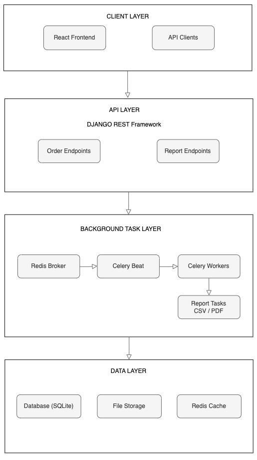
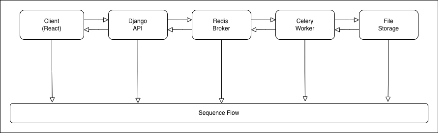
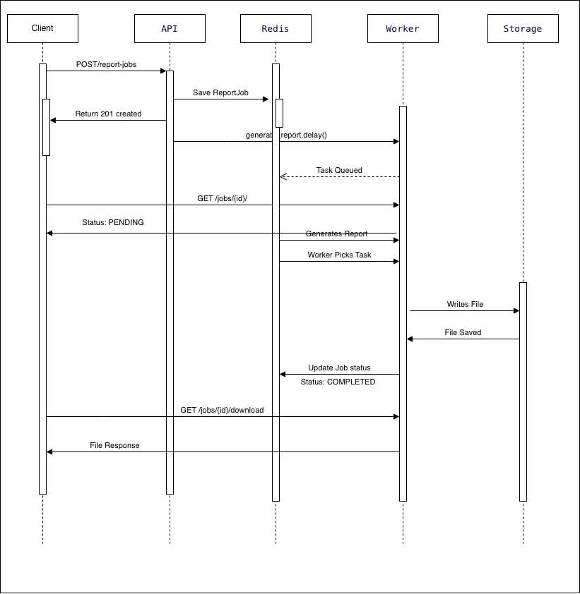

# Background Report Generator for Business Orders

# Overview

This system allows users to:

Create business orders with multiple items

Generate a downloadable CSV or PDF report of completed orders

Process report generation asynchronously using Celery

Poll report status from the frontend

Download the generated report file(csv/pdf)

The key architectural requirement was that report generation must not block the API request.

# Architecture Overview

Core Stack

Backend: Django + Django REST Framework

Frontend: React (Vite)

Background Tasks: Celery

Broker: Redis

Storage: Local filesystem (reports directory respective csv and pdf directories for file types)




# System Flow

High-Level Flow

React → Create Order

React → Request Report Generation

Django API → Create ReportJob record

Django API → Enqueue Celery task

Celery Worker → Generate CSV or PDF file

Worker → Save file to disk

Worker → Update ReportJob status

React → Poll report status

React → Download file when status = COMPLETED






# Background Task Configuration

1. Celery Setup

Celery is configured in the Django project as follows:

celery.py

Configures Celery app

Loads Django settings

Auto-discovers tasks from installed apps

__init__.py

```pyhton
from .celery import app as celery_app
__all__ = ('celery_app',)
```

2. Redis as Broker

Celery uses Redis to:

Store queued tasks

Pass tasks to workers

Track execution state

In settings.py:
```python
CELERY_BROKER_URL = 'redis://localhost:6379/0'
CELERY_ACCEPT_CONTENT = ['json']
CELERY_TASK_SERIALIZER = 'json'
```

3. Report Generation Task

The report task:

Accepts report_job_id

Updates status → PROCESSING 

Generates CSV / PDF file

Saves file to disk

Updates status → COMPLETED

Handles exceptions → sets status → FAILED

This ensures:

API response is immediate

Heavy file generation runs in background

4. Running Celery Worker
```bash
celery -A config worker --loglevel=info
```
Redis must be running before starting the worker.

# Async vs Sync Processing – Trade-offs

Synchronous Approach (Bad for this case)

If report generation was synchronous:

API request would block until CSV or PDF completes

Slow user experience

Risk of request timeout

High memory usage under load

Poor scalability

Example problem: If report takes 10 seconds, user waits 10 seconds.

# Asynchronous Approach (Used Here)

With Celery:

API immediately responds

Heavy processing runs in worker

System remains responsive

Scales horizontally by adding workers

# Setup Instructions

1. Clone Repository
```bash
git clone https://github.com/Hafsusu/background-report-generator.git
cd backend
```

3. Create Virtual Environment
```bash
python -m venv venv
source venv/bin/activate  #for Mac/Linux
venv\Scripts\activate  #for  Windows
```

5. Install Dependencies
```bash
pip install -r requirements.txt
```

7. Install and Start Redis
```bash
redis-server
```

5. Run Migrations
```bash
python manage.py migrate
```

7. Start Django Server
```bash
python manage.py runserver
```

9. Start Celery Worker (Separate Terminal)
```bash
celery -A config worker --loglevel=info
```

# Running the Full System

Start Redis

Start Django

Start Celery worker

Start React frontend on a separate terminal:
```bash
cd frontend
npm install
npm run dev
```

Frontend runs at:
```
http://localhost:5173
```

Backend runs at:
```
http://localhost:8000
```

# Edge Cases Handled

Missing order ID → 400

Non-existent order → 404

Validation errors for order items

Report failure handling

Safe status polling

CORS properly configured
